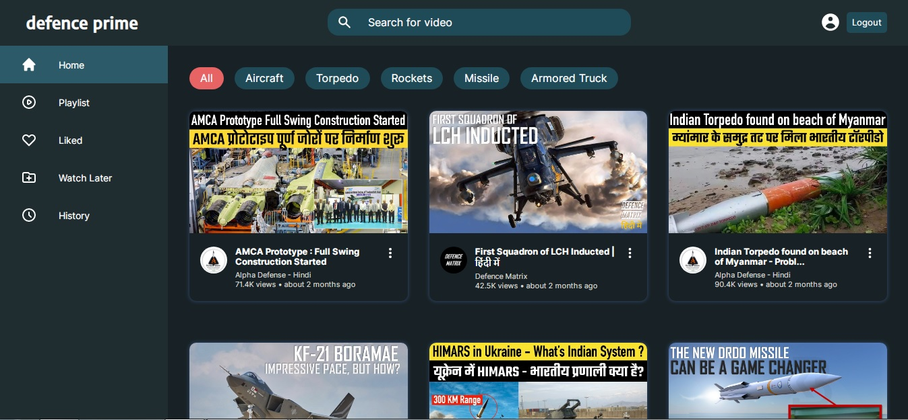

<p align="center">
   
</p>

# Defence Prime

[](https://github.com/imkousik9)

Defence Prime made with nextjs, css and backend nextjs API & planetscale.

# Application Links

Frontend Code -> [https://github.com/imkousik9/defence-prime](https://github.com/imkousik9/defence-prime)
<br>
Deployed URL -> [https://defenceprime.vercel.app](https://defenceprime.vercel.app)
<br>

**Run the site locally**

### Step 1: Clone The Repo

Fork the repository. then clone the repo locally by doing -

```bash
git clone https://github.com/imkousik9/defence-prime.git
```

### Step 2: Install Dependencies

cd into the directory

```bash
cd defence-prime
```

install all the dependencies

```bash
yarn
# or
npm install
```

### Step 3: Start Development Server

Then start the development Server

```bash
yarn dev
# or
npm run dev
```

After running the development server the site should be running on https://localhost:3000

# Tech Stack

<b>Frontend</b>: Nextjs
<br>
<b>Backend</b>: Nextjs API, planetscale
<br>
<b>Styling</b>: CSS
<br>
<b>Deployment</b>: Vercel
